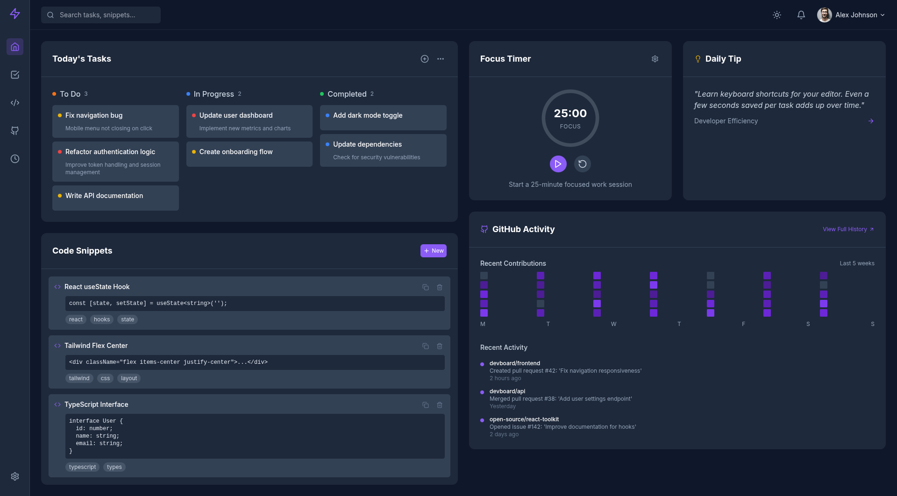

# 🚀 DevBoard – The Developer Productivity Dashboard

DevBoard is a sleek, dark-mode SaaS-style developer productivity dashboard designed to streamline daily workflows. Built with modern UI/UX principles, it's tailored for developers, freelancers, and remote tech professionals who want to stay focused and efficient.

---

## 🎯 Features

- ✅ **Kanban-style Task Management** – Organize tasks by status: To Do, In Progress, and Completed.
- ⏱ **Focus Timer** – Pomodoro-based timer to stay locked in and avoid burnout.
- 💡 **Daily Tip** – Smart productivity quote or tip for daily motivation.
- 💻 **Code Snippets** – Store, tag, and copy frequently used code blocks.
- 🔍 **GitHub Activity Feed** – Mock contribution graph + activity logs.
- 🔒 **Clean, Minimalist UI** – Built with dark theme, neon accents, and a spacious layout.

---

## 🛠 Built With

- **React.js**
- **Tailwind CSS**
- **Framer Motion** (for animations)
- **Modern Design Practices** – Clean typography, iconography, spacing

---

🌐 Live Demo
🔗 https://ibwmahin.github.io/DevBoard

🧠 Inspiration
This project was inspired by my goal to build an advanced-level SaaS UI that reflects professional design and frontend architecture. It serves both as a portfolio piece and a productivity concept tool for developers.

📸 Screenshot

📫 Contact
Mahin
Email: ibwmahin@gmail.com
GitHub: @ibwmahin

⭐️ Show Your Support
If you like this project, give it a ⭐ on GitHub — it motivates me to build more advanced and useful tools!
